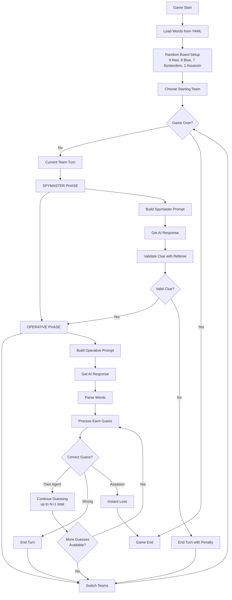

# BASED Eval

**Benchmark for Association, Sorting, and Entity Deduction**

A multi-game AI evaluation framework for testing language model capabilities through strategic games. Currently includes Codenames as the first game module.

## Overview

BASED Eval tests AI models on:
- **Association**: Finding semantic connections between concepts
- **Sorting**: Categorizing and prioritizing information
- **Entity Deduction**: Reasoning about hidden information and making inferences

## Current Games

### 🎯 Codenames

A strategic word association game where AI Spymasters give one-word clues to help AI Operatives identify their team's agents on a 5×5 grid while avoiding enemy agents, innocent bystanders, and the assassin.

**Game Setup:**
- **25 words** arranged in a 5×5 grid
- **Red Team**: 8-9 Agents (9 if starting)
- **Blue Team**: 8-9 Agents (8 if Red starts)
- **7 Innocent Bystanders**
- **1 Assassin** (instant loss if guessed)

**Turn Structure:**
1. **Spymaster** gives a one-word clue and number
2. **Operatives** make up to N+1 guesses based on the clue
3. First team to find all their agents wins
4. Guess the Assassin = instant loss

## Features

- **AI vs AI**: Pit different models against each other
- **Human vs AI**: Interactive mode for human players
- **Flexible Configuration**: Separate model assignment per role
- **External Prompts**: Markdown files for easy prompt tuning
- **Expert Clue Types**: Support for zero clues (0) and unlimited clues
- **Referee Validation**: AI-powered clue validation for fair play
- **Prompt Testing**: Built-in tools to test and debug AI prompts
- **Comprehensive Logging**: Detailed game logs and statistics
- **OpenRouter Integration**: Access to 200+ AI models

## Installation

Requires Python ≥3.12 and [uv](https://github.com/astral-sh/uv).

```bash
git clone <repository>
cd switchboards
uv sync
```

## Quick Start

### Set Up API Key
```bash
export OPENROUTER_API_KEY="your-key-here"
```

### Run AI vs AI Game
```bash
uv run based run --red gpt4 --blue claude
```

### Interactive Mode (Human vs AI)
```bash
uv run based run --red gpt4 --blue claude --interactive red-spymaster
```

### Multiple Games
```bash
uv run based run --red gpt4 --blue claude --num-games 5
```

### Test AI Prompts
```bash
# Test spymaster prompts
uv run based prompt spymaster --seed 42 --team red

# Test operative prompts with regular clues
uv run based prompt operative --seed 42 --clue "TOOLS" --number 3

# Test expert clue types
uv run based prompt operative --clue "ANIMALS" --number 0
uv run based prompt operative --clue "FRUITS" --number unlimited

# Test referee validation
uv run based prompt referee --seed 42 --clue "MILITARY" --number 2
```

## Command Line Options

```bash
uv run based run [OPTIONS]
```

| Option | Description |
|--------|-------------|
| `--red MODEL` | AI model for Red Team |
| `--blue MODEL` | AI model for Blue Team |
| `--interactive MODE` | Enable human player mode (referee, red-spymaster, red-operative, blue-spymaster, blue-operative) |
| `--num-games N` | Number of games to play (default: 1) |
| `--seed N` | Random seed for reproducible games |
| `--words-file PATH` | Path to words YAML file |
| `--red-spymaster-prompt PATH` | Red spymaster prompt file |
| `--red-operative-prompt PATH` | Red operative prompt file |
| `--blue-spymaster-prompt PATH` | Blue spymaster prompt file |
| `--blue-operative-prompt PATH` | Blue operative prompt file |
| `--referee MODEL` | AI model for referee validation |
| `--no-referee` | Disable referee validation |
| `--log-path PATH` | Directory for log files |
| `--verbose` | Enable verbose logging |

### Prompt Testing Commands

```bash
uv run based prompt [spymaster|operative|referee] [OPTIONS]
```

| Option | Description |
|--------|-------------|
| `--team red/blue` | Team color (red or blue) |
| `--seed N` | Random seed for reproducible boards |
| `--clue TEXT` | Sample clue for operative/referee testing |
| `--number N` | Sample number (supports 0, unlimited, or integers) |

## Available Models

The framework supports 45+ models through OpenRouter. Use the `list-models` command to see all available options:

```bash
uv run based list-models
```

**Popular models include:**
- `gpt4`, `gpt5`, `o3`, `o1` - OpenAI models
- `claude`, `sonnet`, `opus-4.1` - Anthropic models  
- `gemini`, `gemini-flash` - Google models
- `grok3`, `grok4` - xAI models
- `llama-3.3`, `qwen3`, `deepseek` - Open source models

**Reasoning models** (o1, o3, grok4, etc.) are automatically detected and configured with appropriate parameters.

## Architecture

BASED Eval uses a modular design with game-specific modules:

**Core Components:**
- **Prompt Manager**: Builds formatted prompts from markdown templates with variable substitution
- **OpenRouter Adapter**: Handles AI API calls with cost tracking and retry logic  
- **Referee**: Validates spymaster clues for fairness

**Codenames Flow:** Build Prompt → Get AI Response → (Referee Validation for Spymasters) → Process Results



## Project Structure

```
based/
├── cli.py              # Command-line interface
├── game.py             # Codenames game logic
├── player.py           # Player classes (AI & Human)
├── prompt_manager.py   # Prompt template management
├── adapters/
│   └── openrouter_adapter.py  # OpenRouter API integration
└── utils/
    └── logging.py      # Logging utilities

inputs/
├── names.yaml          # Word bank for games
└── model_mappings.yml  # Model alias configuration

prompts/
├── red_spymaster.md    # Red team spymaster prompts
├── red_operative.md    # Red team operative prompts
├── blue_spymaster.md   # Blue team spymaster prompts
├── blue_operative.md   # Blue team operative prompts
├── referee.md          # Referee clue validation prompts
└── shared/
    └── game_rules.md   # Shared game rules for all prompts

logs/                   # Game logs and performance analytics
```

## Expert Clue Types

Codenames supports advanced clue strategies:

- **Zero Clues (0)**: "None of our agents relate to this clue" - unlimited guesses, must guess at least one
- **Unlimited Clues**: Multiple related agents from previous rounds - unlimited guesses, no minimum

```bash
# Examples in interactive mode
Red Spymaster: "ANIMALS" (0)        # Zero clue
Blue Spymaster: "FRUITS" (unlimited) # Unlimited clue
```

## Referee Validation

AI-powered clue validation ensures fair play by checking:
- Single word requirement (with exceptions for compound words, proper names, abbreviations)
- No direct board word matches
- No variants of board words
- No letter count references
- No position references

## Game History Tracking

Operatives receive comprehensive game history showing all previous clues and outcomes:

```
Turn 1a: Red Clue: "FRUITS" (3)
  → APPLE ✓, BANANA ✓, COCONUT ○ (bystander)

Turn 1b: Blue Clue: "METALS" (2)
  → IRON ✓, STEEL ✗ (enemy)
```

## Logging & Analytics

The framework creates comprehensive logs for analysis:

1. **Play-by-Play Logs** (`logs/play_by_play_*.log`)
   - Human-readable game events and board states

2. **Box Score Analytics** (`logs/box_scores_*.jsonl`)
   - Team performance summaries in structured format

3. **AI Call Metadata** (`logs/game_metadata_*.jsonl`)
   - Detailed metrics for every AI interaction
   - Tracks tokens used, API costs, response latency

4. **Referee Validation Logs** (`logs/referee_*.log`)
   - Consolidated clue validation decisions

## Development

### Running Tests
```bash
uv run pytest
```

### Code Formatting
```bash
uv run black .
uv run isort .
```

### Type Checking
```bash
uv run mypy based/
```

## Contributing

1. Fork the repository
2. Create a feature branch
3. Add tests for new functionality
4. Ensure all tests pass
5. Submit a pull request

## License

MIT License - see LICENSE file for details.

## Credits

Codenames game design by Vlaada Chvátil. [Official Rules](https://czechgames.com/files/rules/codenames-rules-en.pdf)
